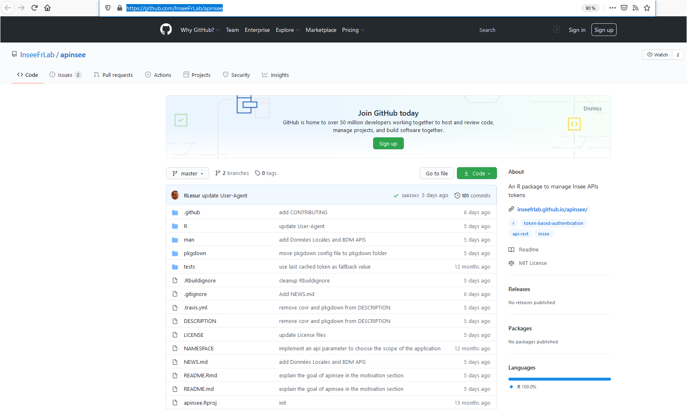
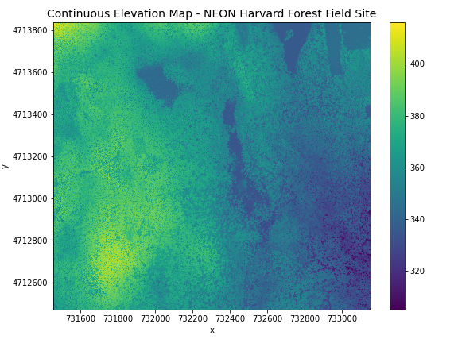
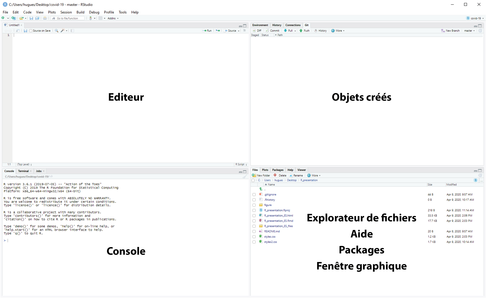
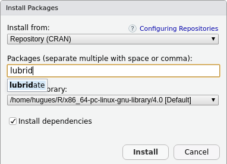
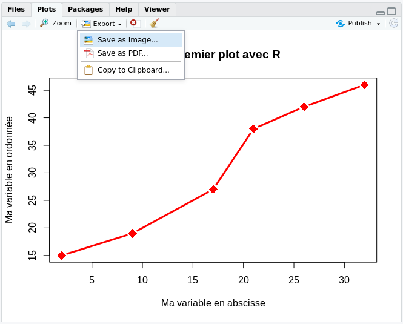
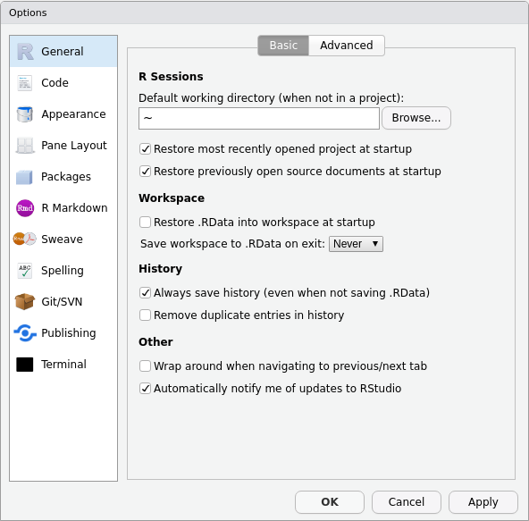
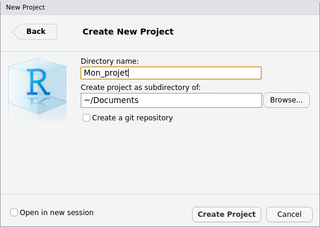
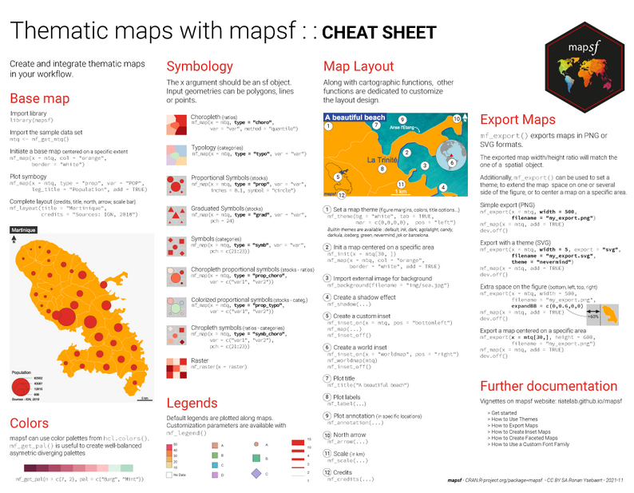

```{r setup, include=FALSE}
knitr::opts_chunk$set(echo = FALSE)
options("scipen" = 10)

```

#  {data-background="figure/calculatrice.png" data-background-size="30%"}


## Une calculatrice


<p class="moyp22">Le langage R offre les mêmes fonctionnalités qu'une calculatrice.<br>Vous pouvez utiliser tous les opérateurs arithmétiques.</p>

<div id="vide3"></div>

Nom |	Opérateur |	Exemple | Résultat
:-:  | :-:  | :-: | :-:
Addition |	**+** |	5 + 3 |	8
Soustraction | 	**-** |	5 - 1 |	4
Multiplication  |	* |	5*5 |	25
Division |	**/** |	5/5 |	1
Puissance |	**^** |	5^5 |	3125
Modulo |	**%%** |	5 %% 5 |	0
Quotient Décimal |	**%/%** |	5 %/% 5 |	1

## Une calculatrice

<div id="vide4"></div>

```{r eval=TRUE, echo=TRUE, include =TRUE }
3 + 5
```

<div id="vide4"></div>

```{r eval=TRUE, echo=TRUE, include =TRUE }
(3+4) * 5^3 / 10

```

<div id="vide4"></div>

```{r eval=TRUE, echo=TRUE, include =TRUE }

(3.2 + 4.1) * 5.9^3 / 10.002

```

## Une super calculatrice

<p class="moyp22">R permet également l'utilisation d'opérateurs relationnels</p>

<div id="vide3"></div>

Conditions |	Opérateur |	Exemple | Résultat
:-:  | :-:  | :-: | :-:
plus petit que  |	**<**  |	5 < 5 | FALSE
plus grand que  |	**>**  |	5 > 5 | FALSE
plus petit ou égal à  |	**<=**  |	5 <= 5 | TRUE
plus grand ou égal à  |	**>=**  |	5 >= 5 | TRUE
égal à  |	**==**  |	5 == 5  | TRUE
différent de  |	**!=**  |	5 != 5  | FALSE
présent dans |	**%in%**  |	5 %in% 1:5 | TRUE

## Une super calculatrice

<div id="vide4"></div>

```{r eval=TRUE, echo=TRUE, include =TRUE}

# x égale à y ?
5 == 5

# x différent de y ?
5 != 5

# x présent dans y ?
# 5 %in% c(7,4,5,3)
c(1,7,3,2) %in% c(7,4,5,3)


```

## Une super calculatrice

<p class="moyp2">Et d'opérateurs logiques :<p>

<div id="vide3"></div>

Condition |	Opérateur 
:-:  | :-: 
différent de |	**!**
et |	**&**
ou | **I**
ou exclusif |	**xor()**
valeur manquante | **is.na()**
valeur nulle | **is.null()**
vrai | **isTRUE()**
faux  | **isFALSE()**


## Une super calculatrice

<div id="vide4"></div>

```{r eval=TRUE, echo=TRUE, include =TRUE}


# Valeur manquante ?
is.na(NA)

# Différent de valeur manquante ?
!is.na(13)

# Contrôle à deux condtions
!is.na(13) & 2 == 2

```


## Et bien plus...

<p class="moyp22">Des milliers de fonctions pour manipuler et analyser vos données</p>

<div id="vide4"></div>

```{r eval=TRUE, echo=TRUE, include =TRUE, fig.height=3.1}

# Arrondir un nombre
round(12.33453)

```

<div id="vide4"></div>

```{r eval=TRUE, echo=TRUE, include =TRUE, fig.height=3.1}

# Nombre de caractères
nchar("Bla bla bla...")

```


## Et bien plus...

<p class="moyp22">Des fonctions pour représenter vos données</p>

```{r eval=TRUE, echo=TRUE, include =TRUE, fig.height=3.9}


# Représentation graphique
plot(x = 1:20, y = 11:30)
```


# objets <- R


## Programmation Orientée Objet ?

<br> 

<p class="medpcenter">Tout ce que l'on crée dans R sont des objets...</p>
<p class="medpcenter">Mais **il ne s'agit pas (comme Python) d'un langage de POO!**</p>

<br>

<p class="smallpcenter2">La **Programmation Orientée Objet** est un paradigme de programmation basé sur le concept d’**objets, qui peuvent contenir des données et métadonnées (attributs)**, et qui sont **associés à des procédures, souvent appelées méthodes**.</p>

<br>

<p class="smallpcenter">**Il est néanmoins possible de faire de la POO avec R...**</p>

<br>


## Créer un objet

<p class="smallpcenter">Pour créer un objet, donnez lui un nom et **assignez-lui un contenu avec le symbole** :</p>

<p class="nrmp2"> <- </p> 

```{r eval=TRUE, echo=TRUE, include =TRUE}

obj <- 15

obj + 15

obj <- (obj + 45) / 2

obj
```


## Créer un objet

<p class="moyp22">Assignez différents types de données :</p>

<div id="vide3"></div>

Type  |	définition  |	Exemple  
:-:  | :-:  | :-: |
**numeric** |	nombre   |	3 ou 4.23 
**integer** |	nombre entier  |	3  
**double** |	nombre double  |	4.23 
**logical**  | logique ou	booléen  |	TRUE ou FALSE 
**string** |	chaîne de caractères  |	"Hello"
**factor**  |	string (modalités prédéfinies)  | "Hight"
**date**  |	date formatée  |	2020-12-14
**NA**  |	absence de valeur (tout type) |	NA 

## Créer un objet

<div id="vide3"></div>

```{r eval=TRUE, echo=TRUE, include =TRUE}

obj <- NA
obj <- 3.14 
obj <- FALSE    

obj <- "Bla bla..." 
obj <- factor("A", levels = c("A", "B", "C"))
obj <- as.Date("2020-10-08")

# Type de données ?
class(obj)

# Contenu de mon objet ?
print(obj)

```


## Les fonctions

<p class="smallpcenter">**Une fonction est un objet**</p> 
<p class="smallpcenter">**Une fonction contient une série de commandes (code)** qui effectuent une tâche prédéfinie. Elle prend des **informations (arguments) en entrée et renvoie un résultat**</p> 

```{r eval=TRUE, echo=TRUE, include =TRUE}

elle <- "Julie"  
lui <- "Thomas"  

# paste() pour concaténer des chaînes de caractères
elle_lui <- paste(elle, lui, sep = " aime ")

elle_lui

# gsub() pour remplacer un 'pattern' de caractère
gsub(pattern = "Thomas", replacement = "Tristan", x = elle_lui)

```

## Les fonctions


<p class="smallpcenter" style="margin-top:50px;margin-bottom:35px;">**Les fonctions peuvent être :**</p> 


<ul class="pucsmall2">
> - Mises à disposition par le **R base** (fonctions primitives ou standards) 
> - Mises à disposition par un **package** 
> - **Développées en local** par vous-même.
</ul>


<p class="smallpcenter" style="margin-top:60px;">Elles s'utilisent toujours de la même façon : **nom()**</p> 


```{r eval=TRUE, echo=TRUE, include =TRUE}

# Construction d'une fonction, qui écrit "Hello" dans la console
fonction_hello <- function() { print("Hello") }

# Utilisation de la fonction
fonction_hello()


```

## Les arguments


<p class="moyp22">Le plus souvent, des **arguments doivent être renseignés pour utiliser une fonction**. Il suffit de leur attribuer une valeur.</p> 

```{r eval=TRUE, echo=TRUE, include =TRUE, fig.height=2.7}

x <- seq(from = -20, to = 22, by = 2)
y <- rep(10:20,  2)

plot(x , y , type = "b",
     pch = 18, cex = 1.2, lwd = 2, col= "blue",
     main = "Mon premier plot avec R", 
     xlab = "Ma variable en abscisse", ylab = "Ma variable en ordonnée")


```


## Les objets


<p class="moyp2">**De nombreux objets R adaptés aux différents types de données : **</p> 

<ul class="pucsmall3">
> - **Vector** - *liste d'éléments de même nature*
> - **Data.frame** - *Tableau de données*
> - **Matrix** - *Matrice*
> - **Array** - *Ensemble de matrices*
> - **List** - *Liste d'objet*
> - **Factor** - *vecteur avec une liste de modalités prédéfinies*
> - **Simple feature** - *Données géographiques*
> - **Time serie** - *Série temporelle*
> - **...**

</ul>


## Vector

<p class="moyp22">**Le vecteur est l'objet de base de R**. Il permet de stocker **un ou plusieurs éléments du même type**. </p>

```{r echo=TRUE, include =TRUE}

# Vecteur d'un unique élément de type string
nom <- "Martina"

```

<p class="smallpcenter">**La fonction c() permet de construire un vecteur de plusieurs éléments**,</p>

```{r echo=TRUE, include =TRUE}

noms <- c("Martina", "Leo", "Inès", "Joshua")

noms

```

## Vector

<p class="moyp22">Pour naviguer dans cet objet unidimensionnel, utilisez les crochets.</p>


```{r eval = FALSE, echo=TRUE, include =TRUE}

# Sélection du premier élément
noms[1]

# Sélection des éléments 2 et 4
noms[c(2,4)]

```


```{r eval = TRUE, echo=FALSE, include =TRUE}

noms[c(2,4)]


```


```{r echo=TRUE, include =TRUE}

# Assigner dans un nouvel objet pour garder en mémoire
Select_nom <- noms[c(1,3)]

Select_nom

```


## Data.frame


<p class="moyp22">**Le data.frame correspond au tableau de données classique**. il se compose de plusieurs colonnes pouvant contenir des données de nature différente. **Chaque colonne d'un data.frame est un vecteur**.</p>


```{r echo=TRUE, include =TRUE}

# Construction de plusieurs vecteurs de même longueur

nom <- c("Modibo Keïta", "Moussa Traoré", "Alpha Oumar Konaré")
date_naissance <- c("1915-06-04", "1936-09-25", "1946-02-02")
annee_arrivee_pouvoir <- c(1960, 1968, 1992)
duree_au_pouvoir <- c(8, 23, NA)
parcours_militaire <- c(FALSE, TRUE, FALSE)

```

<br>

<p class="moyp">**Utilisez la fonction data.frame() pour construire un tableau**</p>


## Data.frame


<p class="moyp22">**Utilisez la fonction data.frame() pour construire un tableau**</p>

```{r echo=TRUE, include =TRUE}

MyTab <- data.frame(nom,
                    date_naissance,
                    annee_arrivee_pouvoir,
                    duree_au_pouvoir,
                    parcours_militaire )

MyTab
  
```


## Data.frame


<p class="moyp22">Utilisez les crochets pour naviguer dans un tableau : <br> MyTab[ **ligne , colonne** ]</p>

```{r eval=FALSE, echo=TRUE, include =TRUE}

## SELECTION PAR INDEX
# Première ligne et toutes les colonnes
MyTab[ 1 , ]

# Toutes les lignes  et colonnes 1, 3 et 5
MyTab[  , c(1,3,5)]

# 2e ligne et colonnes 1 et 5
MyTab[2, c(1,5)]

## SELECTION PAR NOM
# 2e ligne et colonnes 1 et 5
MyTab[ 2 , c("nom", "parcours_militaire")]


```


```{r echo=FALSE, include =TRUE}

MyTab[ 2 , c("nom", "parcours_militaire")]

  
```

## Data.frame


<p class="moyp22">Vous pouvez également utiliser le signe $ pour séléctionner une colonne : <br> <br> MyTab**$**date_naissance</p>

```{r eval=FALSE, echo=TRUE, include =TRUE}

## Uilisation du $
# Séléction colonne 'date_naissance'
MyTab$date_naissance

# Valeur de la seconde ligne dans la colonne 'date_naissance'
MyTab$date_naissance[2]

# Colonne 'parcours_militaire', ligne 1 et 3
MyTab$date_naissance[c(1,3)]

```


```{r echo=FALSE, include =TRUE}

# Colonne 'parcours_militaire', ligne 1 et 3
MyTab$date_naissance[c(1,3)]

  
```

## Data.frame


<p class="moyp22">**Utilisez les différents opérateurs** pour sélectionner par condition : </p>

```{r eval=FALSE, echo=TRUE, include =TRUE}

# Séléction par condition
MyTab[ MyTab$duree_au_pouvoir > 20 , ]
 
# Condition ET Condition
MyTab[MyTab$annee_arrivee_pouvoir > 1965  &  MyTab$parcours_militaire == FALSE, ]

# Condition OU Condition
MyTab[MyTab$duree_au_pouvoir >= 10  |  is.na(MyTab$duree_au_pouvoir), ]

# Utilisation de fonction
MyTab[nchar(MyTab$nom) > 15, ]
```


```{r echo=FALSE, include =TRUE}

MyTab[nchar(MyTab$nom) > 15, ]

  
```


## list

<p class="moyp22">**Une liste permet de stocker plusieurs objets (peu importe le type) en un seul**. Une liste est une collection d'objet.</p>


<p class="moyp">Utilisez la fonction **list()** pour construire une liste </p>


```{r eval=FALSE, echo=TRUE, include =TRUE}

# Vecteur de chaînes de caractères
noms <- c("Martina", "Leo", "Inès", "Joshua")
# Vecteur de numeric
ages <- c(21, 20, 25, 18)
# data.frame
tablo <- data.frame(noms, ages)
# fonction
fonction_hello <- function() { print("Hello") }

# Construction d'un objet list
Ma_list <- list(noms, ages, tablo, fonction_hello)

```


<p class="moyp2">**C'est un super objet** très utile et puissant.<br> Cet objet est utilisé par plusieurs packages de référence</p>

## List

<p class="moyp22">Pour naviguer dans une liste, utilisez des **doubles crochets** : <br>  **Ma_list[[ index ]]**</p>


```{r eval=TRUE, echo=FALSE, include =FALSE}

# Vecteur de chaînes de caractères
noms <- c("Martina", "Leo", "Inès", "Joshua")
# Vecteur de numeric
ages <- c(21, 20, 25, 18)
# data.frame
tablo <- data.frame(noms, ages)
# fonction
fonction_hello <- function() { print("Hello") }

# Construction d'un objet list
Ma_list <- list(noms, ages, tablo, fonction_hello)
     
     

```


```{r eval=TRUE, echo=TRUE, include =TRUE}

# Séléction du 1er objet de Ma_list
Ma_list[[1]]

```

```{r eval=TRUE, echo=TRUE, include =TRUE}

     
# Séléction au sein d'un objet d'une list :
# 2e ligne et 1ère colonne de mon objet 3
Ma_list[[3]][4 , 2]


```


# R base + packages

## R base

```{r warning=FALSE, message=FALSE, eval=TRUE, include= TRUE, echo=FALSE}

library('rvest')
url <- "https://cran.r-project.org/web/packages/available_packages_by_date.html"
#Reading the HTML code from the website
webpage <- read_html(url)
td <- webpage %>%  html_nodes("td")
rank_data <- html_text(td)

vec <- c(NULL)
for (t in seq(1,length(rank_data),3))  {
vec <-  c(vec, rank_data[t])
}

library(stringr)
vec <- str_trim(vec)
test <- as.data.frame(vec)
test$nb <- 1
test$date <- as.Date(test$vec)
test <- test[,c(3:2)]

library(plyr)
test2 <-  ddply(test, .(date), summarize, nb=sum(nb))
test2$cum <- cumsum(test2$nb)
test <- test2[,c(1:3)]

nb_function_base <- length(lsf.str("package:base"))

# Nombre de fonctions primitives
base <- length(lsf.str("package:base")) 
stats <- length(lsf.str("package:stats")) 
utils <- length(lsf.str("package:utils")) 
methods <- length(lsf.str("package:methods")) 
grDevices <- length(lsf.str("package:grDevices")) 
graphics <- length(lsf.str("package:graphics")) 
datasets <- length(lsf.str("package:datasets")) 


datasetsbase <- c(data(package = "datasets"))
nb_datasets <- length(datasetsbase$results)
  
Nb_prim <- base + utils + stats + methods + grDevices + graphics + datasets 


library(grid)
library(splines)
library(stats4)
library(tcltk)
library(tools)
grid <- length(lsf.str("package:grid")) 
splines <- length(lsf.str("package:splines")) 
stats4 <- length(lsf.str("package:stats4")) 
tcltk <- length(lsf.str("package:tcltk")) 
tools <- length(lsf.str("package:tools")) 

Nb_prim_2 <- grid + splines + stats4 + tcltk + tools

```


<p class="moyp22_2">Le langage R offre **`r Nb_prim` fonctions de base*** stockées dans 7 packages standards, **installés et chargés automatiquement** :</p>


<ul class="xpucsmall">

> - **base** = `r base` **fonctions de base** qui permettent à R de fonctionner comme un langage
> - **utils** = `r utils` **fonctions utilitaires** (ex : installation de package, import/export...)
> - **stats** = `r stats` **fonctions statistiques** pour les calculs et la génération de nombres aléatoires
> - **grDevices** = `r grDevices` **fonctions pour la gestion des périphériques graphiques**
> - **graphics** = `r graphics` **fonctions graphiques**
> - **methods** = `r methods` **fonctions pour définir des méthodes et classes** pour les objets R
> - **datasets** = `r nb_datasets` **jeux de données** d'exemples


</ul>

<p class="moyp2222">`r Nb_prim_2` fonctions supplémentaires* sont également mises à disposition par l'intermédiaire de 5 autres packages pré-installés (grid, splines, stats4, tcltk, tools), mais qui ne sont pas chargés automatiquement.</p>

<p class="xsmallpbis">\* *Calculé le `r Sys.Date()`*</p>

## R base


<p class="moyp2_2 ">**Les fonctionnalités standards (ou primitives) proposées par R permettent de réaliser beaucoup de choses**</p>

<p class="moyp2" style="margin-bottom:40px;">Il est cependant parfois nécessaire d'**installer des packages** <br> **pour profiter de certaines fonctionnalités** :</p>

<ul class="xpucsmall ">


> - **Gérer des types de données spécifiques** (ex : géographique, image, son...)
> - **Optimiser son code** (fonction codées en C++, parallélisation...)
> - **Interagir avec d'autres outils** (web scraping, production de support...)
> - **Utiliser des méthodes d'analyses spécifiques** (ex : réseau, séquence, NLP...)
> - Produire des **représentations graphiques particulières** et/ou élégantes

> - ...

</ul>


## Packages du CRAN


<p class="moyp2">**`r max(test2$cum)`* packages** sont disponibles sur le [***Comprehensive R Archive Network***](https://cran.r-project.org/web/packages/available_packages_by_name.html)</p>


<p class="moyp222">L'installation d'un package peut se faire en clic-bouton avec Rstudio. Cette opération n'est à réaliser qu'une fois, sauf si vous souhaitez mettre à jour le package.</p>


```{r warning=FALSE, message=FALSE, eval=FALSE, include= TRUE, echo=TRUE}

# Utilisez install.packages() pour installer un package en ligne de code
# Exemple avec le package "mapsf"
install.packages("mapsf")

```


<p class="moyp222">Pour utiliser les fonctions du package, **chargez la librairie** :</p>

```{r warning=FALSE, message=FALSE, eval=FALSE, include= TRUE, echo=TRUE}

library(mapsf)

```

<p class="moyp222">Il est nécessaire de charger la librairie à chaque nouvelle session R</p>


<p class="xsmallpbis">\* *Calculé le `r Sys.Date()`*</p>

## Autres ?

<div id="vide2"></div>

<p class="moyp2">**Le** [***Comprehensive R Archive Network***](https://cran.r-project.org/web/packages/available_packages_by_name.html) **est le système officiel** de stockage et de mise à disposition des packages R. Il existe d'autres sources : </p>


<div id="vide3"></div>


<ul class="xpucsmall ">

> - [***Bioconductor***](https://www.bioconductor.org/) qui concentre des packages portant sur l'analyse des données génomiques
> - [***R-forge***](https://r-forge.r-project.org/) qui est une plateforme orientée vers les développeurs 
> - [***GitHub***](https://github.com/) qui est un service web d'hébergement et de gestion de développement de logiciels, utilisant le logiciel de gestion de versions Git

</ul>

<div id="vide3"></div>

<p class="moyp2">**De nombreux packages fonctionnels et très intéressants sont uniquement disponibles sur GitHub...** Attention, ils ne bénéficient pas du système de contrôle offert par le CRAN !</p>


## GitHub

<p class="moyp2">[**GitHub**](https://github.com/) **permet aux développeurs de programmer de manière collaborative**. Beaucoup de développeurs y partagent leur package, et profitent ainsi de contributions externes</p>


<p align="center"></p>


## GitHub

<p class="moyp222">**Un package peut connaître une longue période de développement. Cela ne l'empêche pas d'être opérationnel**. C'est par  exemple le cas du package [apinsee](https://github.com/InseeFrLab/apinsee) destiné à faciliter l’authentification aux [API de l’INSEE](https://api.insee.fr/catalogue/). Pour l'installer depuis GitHub :</p>

```{r warning=FALSE, message=FALSE, eval=FALSE, include= TRUE, echo=TRUE}

# Le package remotes permet d'installer un package stocké sur GitHub
install.packages("remotes")

# Chargez la librairie
library(remotes)

# Utilisez la fonction install_github() en indiquant le nom du dépôt
install_github("inseefrlab/apinsee")

# Chargez la librairie
library(apinsee)

```

<p class="moyp222">Sur Windows, il est nécessaire d'installer [Rtools](https://cran.r-project.org/bin/windows/Rtools/) pour utiliser les packages qui interagissent avec le système d'exploitation ([*remotes*](https://cran.r-project.org/web/packages/remotes/index.html), [*devtools*](https://cran.r-project.org/web/packages/devtools/index.html)...)</p>


#  {data-background="figure/tidy.jpg" data-background-size="35%"}

<p class="nrmp4">PACKAGES POPULAIRES</p>


<br>
<br>
<br>
<br>
<br>
<br>


## Une opération... plusieurs solutions !


<br>

<p class="moyp3">**Une opération peut être réalisée de plein de façons différentes**, en utilisant des fonctions **primitives** ou provenant de **packages**.</p>
<p class="moyp3">Chacun ses préférences. Mais **il est peut être utile de connaître les utilisations les plus courantes**</p>

<p class="moyp4">**Petit tour d'horizon...**</p>


## Import


<div id="leftp">
<div id="left_4">
<div id="vide">
</div>
<p align="center" ></p>
</div>
<div id="right_4">
<p class="legend3">[**R base**](https://stat.ethz.ch/R-manual/R-devel/library/base/html/00Index.html)</p>
<p class="legend4">Fichiers texte</p>
</div>
</div>

<div id="rightp">
<div id="left_4">
<p align="center"></p>
</div>
<div id="right_4">
<p class="legend3">[**readr**](https://readr.tidyverse.org/)</p>
<p class="legend4">Tableaux (csv, tsf, fwf, log...)</p>
</div>
</div>

<div id="vide">
</div>

<div id="leftp">
<div id="left_4">
<p align="center"></p>
</div>
<div id="right_4">
<p class="legend3">[**readxl**](https://readxl.tidyverse.org/)</p>
<p class="legend4">Fichiers Excel</p>
</div>
</div>

<div id="rightp">
<div id="left_4">
<p align="center"></p>
</div>
<div id="right_4">
<p class="legend3">[**haven**](https://haven.tidyverse.org/)</p>
<p class="legend4">Données SPSS, Stata et SAS</p>
</div>
</div>


## Collecte


<div id="leftp">
<div id="left_4">
<div id="vide">
</div>
<p align="center"></p>
</div>
<div id="right_4">
<p class="legend3">[**rvest**](http://rvest.tidyverse.org/)</p>
<p class="legend4">web scraping (Rstudio)</p>
</div>
</div>

<div id="rightp">
<div id="left_4">
<p align="center" ></p>
</div>
<div id="right_4">
<p class="legend3">[**plumber**](https://www.rplumber.io/index.html)</p>
<p class="legend4">Créer interface API</p>
</div>
</div>


<div id="leftp">
<div id="left_4"  >
<div id="vide">
</div>
<p align="center" ></p>
</div>
<div id="right_4">
<p class="legend3">[**rselenium**]()</p>
<p class="legend4">web scraping (Selenium)</p>
</div>
</div>

<div id="rightp">

<p class="legend333">**Interfaces d'API et BD**</p>
<div id="leftppp">
<p class="legend444">[**eurostat**](http://ropengov.github.io/eurostat/articles/website/eurostat_tutorial.html) - [rOpenGov](http://ropengov.github.io/projects/) package - Interface API Eurostat</p>
<p class="legend444">[**insee**](https://hadrilec.github.io/insee/) - Données et métadonnées INSEE ([BDM](https://api.insee.fr/catalogue/site/themes/wso2/subthemes/insee/pages/item-info.jag?name=BDM&version=V1&provider=insee))
<p class="legend444">[**wbstats**](https://github.com/nset-ornl/wbstats) et [**WDI**](https://vincentarelbundock.github.io/WDI/) - Interface API et données Banque mondiale</p>
<p class="legend444">[**wpp2017**](https://cran.r-project.org/web/packages/wpp2017/index.html) - Données [UN](https://population.un.org/wpp/) (*World Population Prospects 2017*)</p>
<p class="legend444">[**rnaturalearthdata**](https://github.com/ropensci/rnaturalearthdata) - [rOpenSci](https://ropensci.org/packages/) package - Données [Natural Earth](http://www.naturalearthdata.com/)</p>
<p class="legend444">[**osmdata**](https://cran.r-project.org/web/packages/osmdata/vignettes/osmdata.html) - [rOpenSci](https://ropensci.org/packages/) package - Interface API [OpenStreetMap](https://www.openstreetmap.fr/)</p>
<p class="legend444">[**rtweet**](https://github.com/ropensci/rtweet) - [rOpenSci](https://ropensci.org/packages/) package - Interface API [Twitter](https://twitter.com/?lang=fr) </p>
<p class="legend444">[**tuber**](https://github.com/soodoku/tuber) - Interface API [Youtube](https://www.youtube.com/?hl=fr&gl=FR)</p>
<p class="legend444">[**spotifyr**](https://github.com/charlie86/spotifyr) - Interface API [Spotify](https://www.spotify.com/fr/)</p>
<p class="legend444">[**googleAuthR**](https://code.markedmondson.me/googleAuthR/), [**googleAnalyticsR**](https://code.markedmondson.me/googleAnalyticsR/), [**searchConsoleR**](http://code.markedmondson.me/searchConsoleR/)... - API's [Google](https://www.google.com/)</p>
<p class="legend444">...</p>
</div>

</div>


## Manipulation


<div id="leftpp">
<div id="left_4">
<div id="vide2">
</div>
<p align="center" ></p>
</div>
<div id="right_4">
<p class="legend3">[**R base**](https://stat.ethz.ch/R-manual/R-devel/library/base/html/00Index.html)</p>
<p class="legend4">Manipulation de données</p>
</div>
</div>

<div id="leftpp">
<div id="left_4">
<p align="center"></p>
</div>
<div id="right_4">
<p class="legend3">[**data.table**](https://rdatatable.gitlab.io/data.table/)</p>
<p class="legend4">Manipulation de données</p>
</div>
</div>


<div id="leftpp">
<div id="left_4">
<p align="center"></p>
</div>
<div id="right_4">
<p class="legend3">[**dplyr**](https://dplyr.tidyverse.org/)</p>
<p class="legend4">Manipulation de données</p>
</div>
</div>

<div id="vide">
</div>

<div id="leftpp">
<div id="left_4">
<p align="center"></p>
</div>
<div id="right_4">
<p class="legend3">[**tidyr**](https://tidyr.tidyverse.org/)</p>
<p class="legend4">Manipulation de tableaux</p>
</div>
</div>

<div id="leftpp">
<div id="left_4">
<p align="center"></p>
</div>
<div id="right_4">
<p class="legend3">[**lubridate**](https://lubridate.tidyverse.org/)</p>
<p class="legend4">Manipulation de dates</p>
</div>
</div>

<div id="leftpp">
<div id="left_4">
<p align="center"></p>
</div>
<div id="right_4">
<p class="legend3">[**stringr**](https://stringr.tidyverse.org/)</p>
<p class="legend4">Chaînes de caractères</p>
</div>
</div>


## Tidyverse

<p align="center"></p>

<p class="smallpcenter2">Collection de packages conçues pour fonctionner ensemble et basés sur une philosophie commune. <br> Ils abordent un très grand nombre d’opérations courantes dans R, comme l'import/export, web scraping, manipulation de données, visualisation, programmation...</p>


<p class="smallpcenter2">Elles sont en grande partie issues du travail d’[Hadley Wickham](http://hadley.nz/), développeur emblématique qui travaille désormais pour RStudio.</p>


## Statistique mulivariée

<br>
<br>


<div id="leftp">
<div id="right_4">
<p class="legend3">[**R base**](https://stat.ethz.ch/R-manual/R-devel/library/base/html/00Index.html)</p>
<p class="legend4">Statistique univariée, bivariée, <br> test de probabilité...</p>
</div>
</div>
<div id="rightp">
<div id="right_4">
<p class="legend3">[**easystats**](https://easystats.github.io/blog/portfolio/)</p>
<p class="legend4">Suite de packages pour faciliter <br> l'utilisation de techniques statistiques avancées</p>
</div>
</div>


<br>
<br>
<br>

<div id="leftp">
<div id="right_4">
<p class="legend3">[**FactoMineR**](http://factominer.free.fr/index_fr.html)</p>
<p class="legend4">Analyse exploratoire multidimensionnelle <br> cf. *FactoInvestigate*, *factoextra*, *Factoshiny*...</p>
</div>
</div>

<div id="rightp">
<div id="right_4">
<p class="legend3">[**ade4**](http://pbil.univ-lyon1.fr/ade4/)</p>
<p class="legend4">Analyse exploratoire multidimensionnelle <br> avec procédures exploratoires d'essence euclidienne</p>
</div>
</div>


<br>
<br>
<br>


<div id="leftp">
<div id="right_4">
<p class="legend3">[**MASS**](https://cran.r-project.org/web/packages/MASS/index.html)</p>
<p class="legend4">Fonctions issues du livre <br> [*Modern Applied Statistics with S*](https://www.springer.com/gp/book/9780387954578)</p>
</div>
</div>
<div id="rightp">
<div id="right_4">
<p class="legend3">[**ExPosition**](https://cran.r-project.org/web/packages/ExPosition/index.html)</p>
<p class="legend4">Analyse exploratoire multidimensionnelle<br> Décomposition de la valeur singulière</p>
</div>
</div>

## Traitement d'enquête

<br>

<div id="leftpp">
<div id="left_4">
<div id="vide2">
</div>
<p align="center" ></p>
</div>
<div id="right_4">
<p class="legend3">[**R base**](https://stat.ethz.ch/R-manual/R-devel/library/base/html/00Index.html)</p>
<p class="legend4">Statistique basique,<br>tableaux croisés...</p>
</div>
</div>

<div id="leftpp">
<div id="left_4">
<p align="center"></p>
</div>
<div id="right_4">
<p class="legend3">[**survey**](http://r-survey.r-forge.r-project.org/survey/)</p>
<p class="legend4">Construction de plan <br> d'échantillonnage complexe</p>
</div>
</div>

<div id="vide">
</div>

<div id="leftpp">
<div id="left_4">
<p align="center"></p>
</div>
<div id="right_4">
<p class="legend3">[**questionr**](https://juba.github.io/questionr/index.html)</p>
<p class="legend4">Contient un *addin*  <br> (interface graphique)</p>
</div>
</div>


## Analyse Textuelle


<br>
<br>

<div id="leftp">
<div id="right_4">
<p class="legend3">[**quanteda**](https://quanteda.io/)</p>
<p class="legend4">Manipulation et analyse de corpus<br>Issue de l'ERC QUANTESS.</p>
</div>
</div>

<div id="rightp">
<div id="right_4">
<p class="legend3">[**spacyr**](https://spacyr.quanteda.io/)</p>
<p class="legend4">Traitement automatique du langage<br>Adaptation de la librairie Python [spaCy](https://spacy.io)</p>
</div>
</div>

<br>
<br>
<br>


<div id="leftp">
<div id="right_4">
<p class="legend3">[**tm**](http://tm.r-forge.r-project.org/index.html)</p>
<p class="legend4">Text mining<br>Statistique textuelle</p>
</div>
</div>


<div id="rightp">
<div id="right_4">
<p class="legend3">[**tidytext**](https://github.com/juliasilge/tidytext)</p>
<p class="legend4">Text mining - compatible [tidyverse](https://www.tidyverse.org/)<br>Statistique textuelle</p>
</div>
</div>


<br>
<br>
<br>


<div id="leftp">
<div id="right_4">
<p class="legend3">[**text2vec**](http://text2vec.org/)</p>
<p class="legend4">Text mining et NLP<br>Bonne gestion de la mémoire</p>
</div>
</div>


<div id="rightp">
<p class="legend_333">**Package avec interface graphique :**</p>
<div id="leftppp">
<p class="legend_444">[**R.temis**](https://rtemis.hypotheses.org/r-temis-dans-rstudio) - Manipulation et analyse de corpus</p>
<p class="legend_444">[**RcmdrPlugin.temis**](https://rtemis.hypotheses.org/r-temis-dans-rcmdr) - Interface graphique pour R.temis</p>
<p class="legend_444">[**IRaMuTeQ**](http://www.iramuteq.org/) - Interface de R pour les Analyses Multidimensionnelles de Textes et de Questionnaires</p>
<p class="legend_444">...</p>
</div>
</div>


## Analyse de réseau

<br>
<br>


<div id="leftp">
<div id="right_4">
<p class="legend3">[**igraph**](https://igraph.org/r/)</p>
<p class="legend4">Analyse de réseau<br>Disponible en c/c++, python et Mathematica</p>
</div>
</div>
<div id="rightp">
<div id="right_4">
<p class="legend3">[**tnet**](https://cran.r-project.org/web/packages/tnet/tnet.pdf)</p>
<p class="legend4">Analyse pondérée, bimodale<br> et longitudinale des réseaux</p>
</div>
</div>


<br>
<br>
<br>

<div id="leftp">
<div id="right_4">
<p class="legend3">[**bipartite**](https://github.com/biometry/bipartite)</p>
<p class="legend4">Analyse de réseau biparti<br> cf. *FactoInvestigate*, *factoextra*, *Factoshiny*...</p>
</div>
</div>

<div id="rightp">
<div id="right_4">
<p class="legend3">[**blockmodeling**](https://cran.r-project.org/web/packages/blockmodeling/blockmodeling.pdf)</p>
<p class="legend4">Modélisation de réseau valué</p>
</div>
</div>


<br>
<br>
<br>


<div id="centerp">
<div id="right_4">
<p class="legend3">[**Rsiena**](https://www.stats.ox.ac.uk/~snijders/siena/)</p>
<p class="legend4"> Simulation de modèles stochastiques</p>
</div>
</div>


## Données géographiques


<div id="leftp">
<div id="left_4">
<p align="center" ></p>
</div>
<div id="right_4">
<p class="legend3">[**sf**](https://r-spatial.github.io/sf/)</p>
<p class="legend4">**Import, manipulation et analyse** <br> de **données vectorielles**</p>
</div>
</div>

<div id="rightp">
<div id="left_4">
<p align="center"></p>
</div>
<div id="right_4">
<p class="legend3">[**stars**](https://r-spatial.github.io/stars/)</p>
<p class="legend4">**Import et manipulation** <br> de données **raster**</p>
</div>
</div>


<div id="leftp">
<div id="left_4">
<p align="center" ></p>
</div>
<div id="right_4">
<p class="legend3">[**raster**](https://rspatial.org/raster/pkg/index.html)</p>
<p class="legend4">**Import, manipulation et analyse** <br> de données **raster**</p>
</div>
</div>

<div id="rightp">
<div id="left_4">
<p align="center" ></p>
</div>
<div id="right_4">
<p class="legend3">[**terra**](https://rspatial.org/terra)</p>
<p class="legend4">**Analyse** de données **raster** <br> *(En développement)*</p>
</div>
</div>


## Représentation Graphique


<div id="leftp">
<div id="left_4">
<div id="vide">
</div>
<p align="center" ></p>
</div>
<div id="right_4">
<p class="legend3">[**R base**](https://stat.ethz.ch/R-manual/R-devel/library/base/html/00Index.html)</p>
<p class="legend4">Représentation graphique standard<br> nuage de point, histogramme, Boxplot... </p>
</div>
</div>
<div id="rightp">
<div id="left_4">
<p align="center" ></p>
</div>
<div id="right_4">
<p class="legend3">[**ggplot2**](https://ggplot2.tidyverse.org/)</p>
<p class="legend4">Représentation graphique avancée<br> basée sur la [grammaire graphique](https://www.springer.com/gp/book/9780387245447)</p>
</div>
</div>


<div id="leftp">
<div id="left_4">
<p align="center"></p>
</div>
<div id="right_4">
<p class="legend3">[**r2d3**](https://rstudio.github.io/r2d3/)</p>
<p class="legend4">Représentation graphique dynamique<br>Adaptation librairie JavaScript D3</p>
</div>
</div>


<div id="rightp">
<div id="left_4">
<div id="vide">
</div>
<p align="center"></p>
</div>
<div id="right_4">
<p class="legend3">[**plotly**](https://plotly.com/r/)</p>
<p class="legend4">Graphiques interactifs<br>Adaptation librairie JavaScript</p>
</div>
</div>


## Cartographie

<div id="leftp">
<div id="left_4">
<p align="center" ></p>
</div>
<div id="right_4">
<p class="legend3">[**tmap**](https://cran.r-project.org/web/packages/tmap/vignettes/tmap-getstarted.html)</p>
<p class="legend4">Cartographie thématique</p>
</div>
</div>

<div id="rightp">
<div id="left_4">
<p align="center"></p>
</div>
<div id="right_4">
<p class="legend3">[**mapsf**](https://riatelab.github.io/mapsf/index.html)</p>
<p class="legend4">Cartographie thématique</p>
</div>
</div>


<div id="leftp">
<div id="left_4">
<p align="center"></p>
</div>
<div id="right_4">
<p class="legend3">[**mapview**](https://r-spatial.github.io/mapview/)</p>
<p class="legend4">Carte interactive<br>basée sur API Leaflet</p>
</div>
</div>

<div id="rightp">
<div id="left_4">
<br>
<p align="center"></p>
</div>
<div id="vide">
</div>
<div id="vide">
</div>
<div id="right_4">
<p class="legend3">[**leaflet**](https://rstudio.github.io/leaflet/)</p>
<p class="legend4">Adaptation librairie JavaScript</p>
</div>
</div>


## Valorisation


<div id="leftp">
<div id="left_4">
<p align="center" ></p>
</div>
<div id="right_4">
<p class="legend3">[**rmarkdown**](https://rmarkdown.rstudio.com/)</p>
<p class="legend4">*Literate programming* <br> Documents balisés en markdown</p>
</div>
</div>

<div id="rightp">
<div id="left_4">
<p align="center"></p>
</div>
<div id="right_4">
<p class="legend3">[**knitr**](https://yihui.org/knitr/)</p>
<p class="legend4">Compiler les documents <br> markdown -> pandoc </p>
</div>
</div>


<div id="leftp">
<div id="left_4">
<p align="center"></p>
</div>
<div id="right_4">
<p class="legend3">[**pagedown**](https://github.com/rstudio/pagedown)</p>
<p class="legend4">Créer PDFs avec CSS (comme LaTeX)<br>Livre, thèse, article, poster...</p>
</div>
</div>

<div id="rightp">
<div id="left_4">
<p align="center"></p>
</div>
<div id="right_4">
<p class="legend3">[**bookdown**](https://bookdown.org/)</p>
<p class="legend4">Facilite la rédaction de livre</p>
</div>
</div>


## Valorisation

<div id="leftp">
<div id="left_4">
<p align="center" ></p>
</div>
<div id="right_4">
<p class="legend3">[**xaringan**](https://github.com/yihui/xaringan)</p>
<p class="legend4">Création de diaporama</p>
</div>
</div>
<div id="rightp">
<div id="left_4">
<p align="center"></p>
</div>
<div id="right_4">
<p class="legend3">[**blogdown**](https://bookdown.org/yihui/blogdown/)</p>
<p class="legend4">Construction de site</p>
</div>
</div>


<div id="leftp">
<div id="left_4">
<p align="center"></p>
</div>
<div id="right_4">
<p class="legend3">[**shiny**](https://shiny.rstudio.com/)</p>
<p class="legend4">Application interactive</p>
</div>
</div>
<div id="rightp">


<p class="legend33">**Modèles de mise en page :**</p>

<p class="legend44">[**rmdformats**](https://github.com/juba/rmdformats) - Templates documents HTML</p>
<p class="legend44">[**learnr**](https://rstudio.github.io/learnr/) - Tutoriel interactif</p>
<p class="legend44">[**Reveal.js**](https://bookdown.org/yihui/rmarkdown/revealjs.html) - Diaporama </p>
<p class="legend44">[**flexdashboard**](https://rmarkdown.rstudio.com/flexdashboard/) - Tableau de bord</p>
<p class="legend44">...</p>


</div>


#  {data-background="figure/Rstudio_logo.png" data-background-size="50%"}

## l'IDE Rstudio

<p class="smallpcenter">L’Environnement de Développement Intégré mis à disposition par Rstudio a sans aucun doute participé à la croissance du nombre d'utilisateur.rice.s de R.</p>

</p>

<p class="smallpcenter">**Cette interface offre une aisance de développement autant appréciée par les débutants que par les développeurs expérimentés**.</p>


## Une interface complète

<p align="center"></p>

## Fonctionnalités clic-button

<p class="moyp22">De nombreuses **fonctions sont disponibles en bouton** dans l'IDE Rstudio</p>


<div id="leftp">

<p align="center"></p>

<p class="legend" align="center">*Installation de packages*</p>

</div>

<div id="rightp">

<p align="center"></p>

<p class="legend" align="center">*Export de graphique*</p>


</div>


## Fonctionnalités clic-button


<div id="left">


<p align="center"></p>

<p class="legend" align="center">*Import/export de données*</p>


<p align="center"></p>

<p class="legend" align="center">*Interface personnalisable*</p>


</div>

<div id="right">

<p align="center"></p>

<p class="legend" align="center">*Visualisation des objets*</p>

<p align="center"></p>

<p class="legend" align="center">*Explorateur de fichiers*</p>


</div>


## Les projets Rstudio

<p class="moyp222">RStudio propose d'**organiser son travail en projet**. L’idée principale est de **rassembler tous les fichiers d'un même projet dans un répertoire dédié**.<p>

<p align="center"></p>


<ul class="pucsmall2">

> - Facilite le travail discontinu
> - Améliore la portabilité de son travail
> - Garantie la reproductibilité de son travail

</ul>


## Les projets Rstudio


<p align="center"></p>

<p class="smallpcenter">A l'ouverture d'un projet :</p>

<ul class="xpucsmall">

> - **Le répertoire du projet est considéré par défaut comme le répertoire de travail**
> - Rstudio **restaure à l'identique l'état de la session** lors de sa dernière clôture (option)
> - L’historique des commandes saisies lors des précédentes séances de travail est disponible
> - ...

</ul>


#  {data-background="figure/help.png" data-background-size="20%"}

## Aide et documentation

<br>

<p class="moyp3">**C'est l'un des points forts du langage**</p>
<p class="moyp3">**Inclusion et partage** sont au coeur de la communauté R</p>
<p class="moyp3">**Les réponses à vos questions existent** forcément</p>


<p class="moyp4">Mais **où** et **comment** chercher ?</p>


## Auto-complétion

<p class="moyp3">La fonctionnalité d'[auto-complétion](https://blog.rstudio.com/2015/02/23/rstudio-v0-99-preview-code-completion/) proposée par Rstudio peut dans un premier temps être très efficace. Utilisez la touche *tab*.</p>


<br>

<div id="left_2">
<p align="center"></p>
</div>

<div id="center22">
<p align="center"></p>
</div>


<div id="right2">
<p align="center"></p>
</div>


## Auto-complétion


<p align="center" style="margin-top:50px;"></p>

<p align="center"></p>


## Documentation officielle

<p class="moyp2">Les packages (base et CRAN) sont accompagnés d'une documentation. <br>
Vous pouvez y accéder en ligne de commande ou en clic-bouton :</p>

<div id="left">

```{r warning=FALSE, message=FALSE, eval=FALSE, include= TRUE, echo=TRUE}

# Chargement de la librairie
library(mapsf)

# help() ou ?
help(mapsf)
?mapsf

# Sur un package ou sur une fonction
help(mf_map)
?mf_map

```


<p class="legend" style="margin-top:50px;">D'autres fonctions de recherche et <br>  d'accès à la documentation sur <br>  [r-project.org](https://www.r-project.org/help.html)</p>

</div>
<div id="right">
<p align="center" ></p>


</div>

## Vignette, cheatsheet & site web


<p class="moyp2">Certains packages proposent de la documentation plus digeste, comme une [vignette](https://r-pkgs.org/vignettes.html), une [cheatsheet](https://rstudio.com/resources/cheatsheets/), voire même un site web</p>


<div id="left0">
<p align="center" ></p>
<p class="legend">Site web du package [sf](https://r-spatial.github.io/sf/)</p>
</div>

<div id="right0">
<p align="center" ></p>
<p class="legend">Vignette du package [MTA](https://cran.r-project.org/web/packages/MTA/vignettes/MTA.html)</p>
</div>


## Vignette


<p class="moyp222">La vignette est un document qui décrit en profondeur le concept et le fonctionnement d'un package. Il y a parfois plusieurs chapitres...</p>


<div id="left00">
```{r warning=FALSE, message=FALSE, eval=FALSE, include= TRUE, echo=TRUE}

# Vignettes des packages installés
browseVignettes()


```

<p align="left"></p>


</div>

<div id="right00">

```{r warning=FALSE, message=FALSE, eval=FALSE, include= TRUE, echo=TRUE}


# Les vignettes d'un package installé
browseVignettes("mapsf")


```

<p align="left" ></p>
<p class="legend2" >Vignette du package [mapsf](https://riatelab.github.io/mapsf/articles/mapsf.html)</p>
</div>


## Cheatsheet


<p class="moyp222">La Cheatsheet (antisèche) est un format crée par Rstudio. Il s'agit d'un document qui résume brièvement (une ou deux feuilles) les fonctionnalités d'un package.</p>
<p align="center" ></p>
<p class="legend">Retrouvez la majorité des cheatsheets sur [Rstudio](https://rstudio.com/resources/cheatsheets/)</p>


## Site web


<p class="moyp3">De nombreuses librairies de référence possèdent leur site web</p>

<div id="leftter">
<p align="center"></p>
<p class="legend3" >[**ggplot2**](https://ggplot2.tidyverse.org/)</p>
<p class="legend2" style="margin-top:-10px;">*Représentation graphique*</p>
</div>

<div id="centerter">
<p align="center"></p>
<p class="legend3" >[**igraph**](https://igraph.org)</p>
<p class="legend2" style="margin-top:-10px;">*Analyse de réseau*</p>
</div>


<div id="rightter">
<p align="center"></p>
<p class="legend3" >[**plumber**](https://www.rplumber.io/index.html)</p>
<p class="legend2" style="margin-top:-10px;">*Adaptation API*</p>
</div>


## La communauté R


<p class="moyp2">**La communauté R est très active et s'avère prolifique en matière de partage et de documentation** :</p>

<p class="moyp2">Conférences, groupes d'utilisateur.rice.s, manuels, blogs, forums, agrégateurs, MOODLE, MOOC, vidéos, listes de diffusion, réseaux sociaux... ex : </p>

<p align="center"></p>

<p class="moyp2">Il y en a pour tous le monde !</p>


## Les manuels

<p class="moyp2">Il existe **des centaines de manuels** dans différentes langues.<br>Certains sont **focalisés sur une discipline ou une fonctionnalité**.</p>

<p class="moype">Quelques manuels généralistes :</p>
<ul class="pucsmall2">
> - [R for Data Science](https://r4ds.had.co.nz/) - *Hadley Wickam* et *Garrett Grolemund*
> - [Introduction à R et à la programmation](https://vigou3.github.io/introduction-programmation-r/) - *Vincent Goulet*
> - [Une introduction à R et au tidyverse](https://juba.github.io/tidyverse/) - *Julien Barnier*
</ul>

<p class="moype">Quelques manuels thématiques :</p>

<ul class="pucsmall2">
> - [Le Grimoire](http://perso.ens-lyon.fr/lise.vaudor/grimoireStat/_book/intro.html) - statistique - *Lise Vaudor*
> - [R et espace](https://framabook.org/docs/Respace/RetEspace_final_20140901.pdf) - géographie - Groupe *ElementR*
> - [Cartographie thématique avec R](https://rcarto.github.io/carto_avec_r/) - cartographie - *Timothée Giraud*
> - [R Markdown: The Definitive Guide](https://bookdown.org/yihui/rmarkdown/) - valorisation - *Yihui Xie* & *co*
> - ...

</ul>

## Agrégateurs & listes


<p class="moyp2">Plusieurs **sites internet collaboratifs** permettent <br> l'**agrégation de contenu** ou l'**inventaire de ressources**. </p>

<p class="moype">Agrégateurs de contenu</p>
<ul class="pucsmall2">
> - [Rweekly](https://rweekly.org/) - agrégateur de ressources diverses
> - [R-bloggers](https://www.r-bloggers.com/) - agrégateur de billets de blog d'actualité et de tutoriels
> - [Rzine](http://rzine.fr/) - site de référencement de documentation sur la pratique de R en SHS
> - ...
</ul>

<p class="moype" >Inventaires de ressources :</p>

<ul class="pucsmall2">


> - [Awesome R](https://github.com/qinwf/awesome-R) - liste collective de packages et d'outils 
> - [Frrrenchies](https://github.com/frrrenchies/frrrenchies) - liste de ressources francophones ou utiles pour les Français.
> - ...

</ul>


## Blogs

<p class="moyp2">**Certains blogs**, parfois très complets, **sont de véritables mines d'or !**</p>


<br>


<br> 
<ul class="pucsmall2">
> - [Analyse-r](https://larmarange.github.io/analyse-R/) - traitement d'enquête - *Joseph Larmarange*
> - [Dimension](https://dimension.usherbrooke.ca/dimension/v2ssrcadre.html) - statistique & sociétés - *Jean-Herman Guay* 
> - [R-atique](http://perso.ens-lyon.fr/lise.vaudor/) - statistique - *Lise Vaudor*
> - [Rgeomatic](https://rgeomatic.hypotheses.org/) - géomatique - *Timothée Giraud*
> - [schochastics](http://blog.schochastics.net/) - analyse de réseau - *David Schoch* 
> - ...

</ul>


## Forums & listes de diffusion

<p class="moyp2">Vous avez **une question ?**</p>


<p class="moype" >Forums</p>
<ul class="pucsmall2">
> - [Stackoverflow](https://stackoverflow.com/questions/tagged/r) - forum d'entraide généraliste
> - [Grrr](https://join.slack.com/t/r-grrr/shared_invite/zt-46utbgb9-uvo_bg5cbuxOV~H10YUX8w) - plate-forme Slack de discussion instantanée francophone sur R
> - [Cirad](http://forums.cirad.fr/logiciel-R/) - forum francophone d'échange sur R
> - ...
</ul>

<p class="moype" >Listes de diffusion</p>
<ul class="pucsmall2">
> - [R-soc](mailto:r-soc@groupes.renater.fr) - utilisation du logiciel R en sciences sociales
> - [Semin-R](http://rug.mnhn.fr/semin-r/) - liste de diffusion du groupe d'utilisateur.rice.s semin-R
> - ...
</ul>


## Réseaux sociaux 


<p class="moyp2">La **communauté R** est très **active sur les réseaux sociaux**</p>

<br>

<div id="left00">

<p align="center"></p>
<p class="moyp222">Suivez la communauté  <br>  sur twitter </p>
<p class="moyp3">[#rstat](https://twitter.com/search?q=%2523rstats)</p>


</div>
<div id="right00">

<p align="center"></p>
<p class="moyp222">Plusieurs chaînes Youtube existent :</p>

<ul class="xpucsmall">

> - Chaîne de [François Husson](https://www.youtube.com/c/HussonFrancois/videos)
> - Chaîne de [Vincent Goulet](https://www.youtube.com/user/VincentGouletIntroR/videos)
> - ...
</ul>
</div>


# {data-background="figure/R.png" data-background-size="28%"}


<h3>**Réalisé avec...**</h3>

<br>
<br>
<br>
<br>
<br>
<br>
<br>
<br>


<p class="smallpcenter"><b>`r sessionInfo()[1]$R.version$version.string`</b></p>


## Diapositives libres (CC BY 3.0)


<br>


<p class="moyp">Consultation :</p>

<p class="moyp222">https://huguespecout.github.io/Intro_R_Rstudio_FR/</p>


<br>

<p class="moyp">Code source :</p>

<p class="moyp222">https://github.com/HuguesPecout/Intro_R_Rstudio_FR/<p>


<br>


## Remerciements

<br>

<p class="moyp">[Timothée Giraud (CNRS)](https://github.com/rCarto)</p>

<p class="moyp">[Violaine Jurie (Université de Paris)](mailto:violaine.jurie@univ-paris-diderot.fr)</p>

<p class="moyp">[François Rebaudo (IRD)](https://github.com/frareb/)</p>

<p class="moyp">[Ronan Ysebaert (Université de Paris)](mailto:ronan.ysebaert@cnrs.fr)</p>

<br>


<div id="left3">
<p align="center"></p>
</div>

<div id="center2">
<p class="smallpcenter">REVEAL.JS</p>
</div>

<div id="center3">
<p class="moyp"></p>
</div>

<div id="right3">

</div>


# Merci de votre attention 


## On continue ?

<br>

Exemple appliqué :  <br> [Vers une chaîne de traitement reproductible](https://rysebaert.gitpages.huma-num.fr/intro_r_use_case/)</p>
<div class="litito">
>- Avant propos et objectifs
>- Mise en œuvre d'une chaîne de traitement
>- Transposer son analyse
>- Documenter son code
>- Reproduisez l'analyse ! 

</div>


<br>

<p class="smallpcenter">[Voir le diaporama](https://rysebaert.gitpages.huma-num.fr/intro_r_use_case/)</p>


